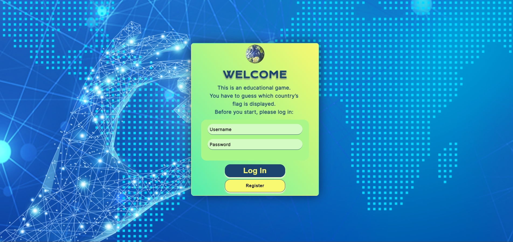
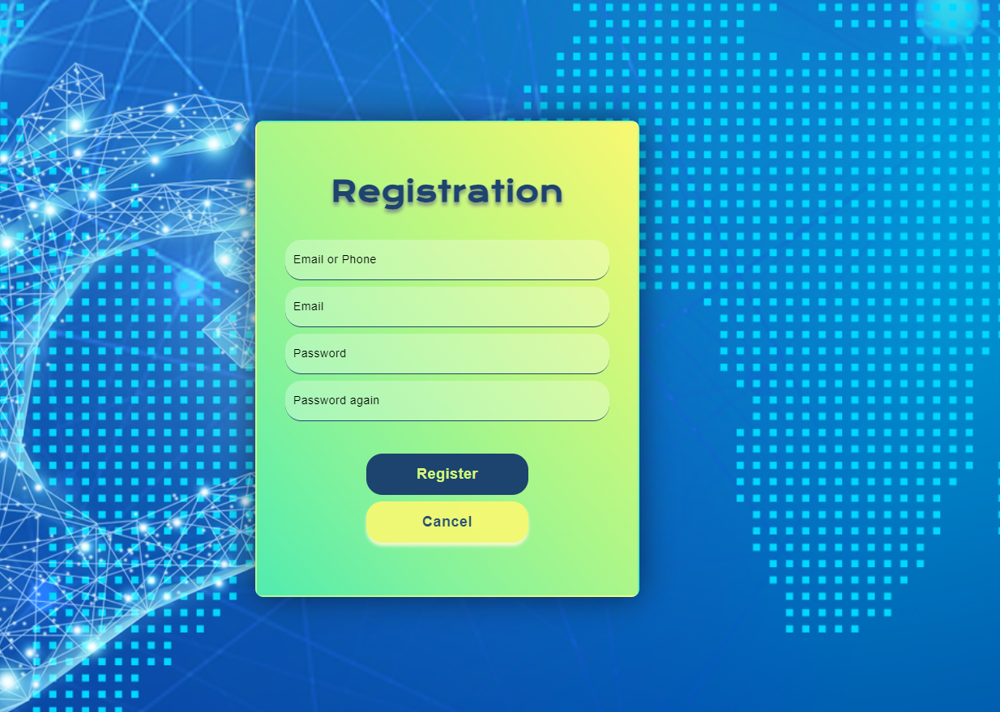
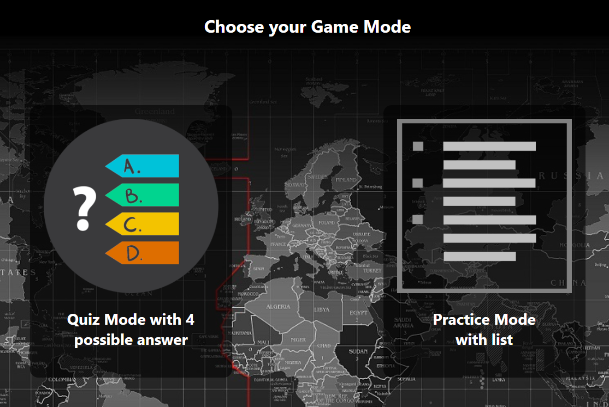
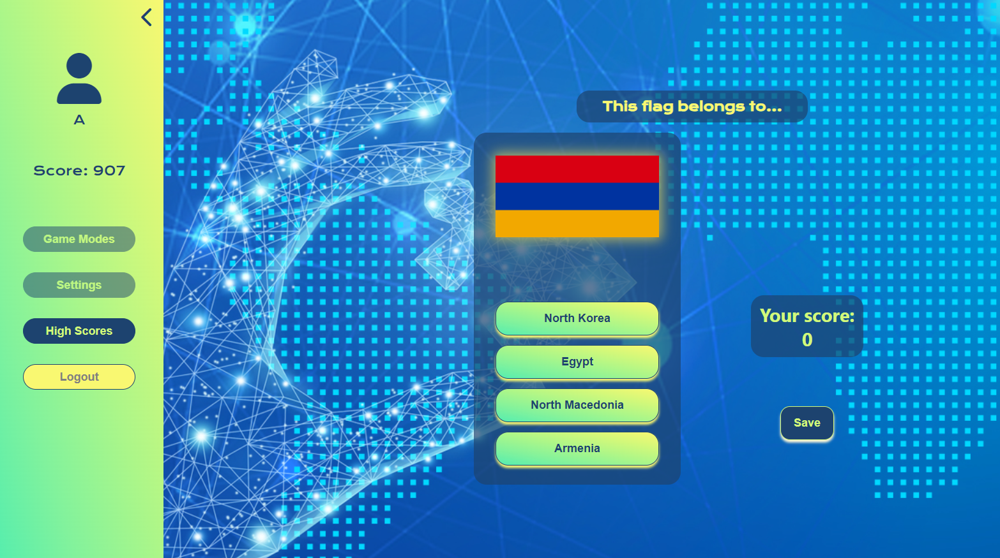
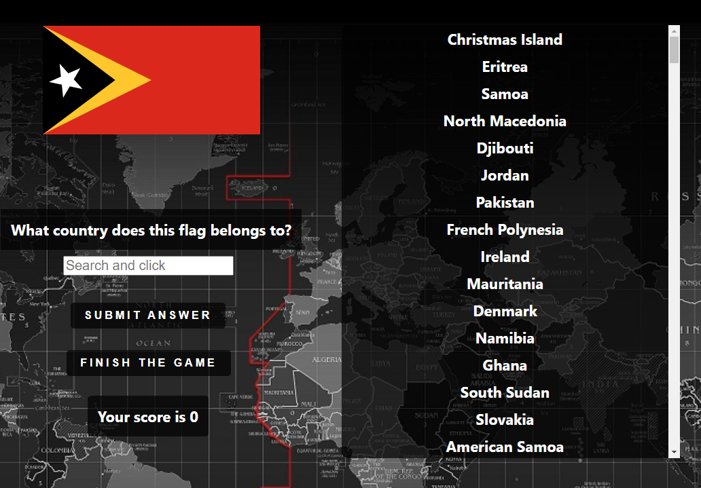

<a name="readme-top"></a>

<!-- PROJECT SHIELDS -->


[][contributor1-url]
[][contributor2-url]
[][contributor3-url]

![LinkedIn][linkedin-shield]

[][linkedin1-url]
[][linkedin2-url]
[][linkedin3-url]

<!-- PROJECT LOGO -->
<br />
<div align="center">
  <a href="https://github.com/FoldiKrizsanIldiko/FunFlags">
    
  </a>

<h3 align="center">Fun with Flags</h3>

  <p align="center">
    This is an educational game with the goal of learning the flags of all countries. You can achieve this by guessing which country the given flag belongs to. You can choose between quiz mode, where suggestions are provided, or, if you are more experienced, you can play without any hints.
    <br />
    <a href="https://github.com/FoldiKrizsanIldiko/FunFlags"><strong>Explore the docs »</strong></a>
    <br />
    <br />
    <a href="https://github.com/FoldiKrizsanIldiko/FunFlags">View Demo</a>
    ide kellene egy youtoub video, ahol van egy regisztráció, és egy kicsi játék bemutató, csak pár másodperc...
</div>

<!-- TABLE OF CONTENTS -->
<details>
  <summary>Table of Contents</summary>
  <ol>
    <li>
      <a href="#about-the-project">About The Project</a>
      <ul>
        <li><a href="#built-with">Built With</a></li>
      </ul>
    </li>
    <li>
      <a href="#getting-started">Getting Started</a>
      <ul>
        <li><a href="#installation">Installation</a></li>
      </ul>
    </li>
    <li><a href="#usage">Usage</a></li>
    <li><a href="#contact">Contact</a></li>
  </ol>
</details>

<!-- ABOUT THE PROJECT -->

## About The Project

<!-- ![Product Name Screen Shot][product-screenshot] -->
<p align="center">

</p>

Embark on an enriching experience with our flag identification game, offering both quiz and select modes. Challenge yourself as the flags of various countries appear, providing an opportunity to test your geographical knowledge. In quiz mode, choose from the displayed countries, while in select mode, choose the correct country from all the cuntries of world. With a diverse array of flags from around the world, this game provides an engaging and educational platform to enhance your global awareness and flag recognition skills.

<p align="right">(<a href="#readme-top">back to top</a>)</p>

### Built With

- [![React][React.js]][React-url]
- [![Express][Express.io]][Express-url]
- [![MongoDB][MongoDB.io]][MongoDb-url]
- [![AWSlambda][AWSLambda.io]][AWSLambda-url]

<p align="right">(<a href="#readme-top">back to top</a>)</p>

<!-- GETTING STARTED -->

## Getting Started

Please follow next steps to set up the game.

### Installation

1. Clone the repo
   ```sh
   git clone https://github.com/FoldiKrizsanIldiko/FunFlags.git
   ```
2. Navigate to the 'server' subdirectory within the cloned directory.
   ```sh
   cd server
   ```
3. Install NPM packages
   ```sh
   npm i
   ```
4. Start running the server
   ```sh
   npm run dev
   ```
5. Navigate to the 'client' subdirectory within the cloned directory.
   ```sh
   cd client
   ```
6. Install NPM packages
   ```sh
   npm i
   ```
7. Start running the frontend
   ```sh
   npm start
   ```

<p align="right">(<a href="#readme-top">back to top</a>)</p>

<!-- USAGE EXAMPLES -->

## Usage

You have to register when you open the game for the first time.

<p align="left">

</p>

You will need to log in later when you start the game.

After logging in, you can choose if you want to play in quize mode or practice mode.

<p align="left">

</p>

In quiz mode you have to click on button, with the name of country.

<p align="left">

</p>

In practice mode, there are a list of all countries. If you start to type in your tip, the list will be selected. You have to choose from the list, click on it, and than submit your answer, by clicking on Submit answer button.

<p align="left">

</p>

If you want to finish the game just hit the Finish game button, and you will see the leaderboard.

Have fun!

<p align="right">(<a href="#readme-top">back to top</a>)</p>

<!-- CONTACT -->

## Contact

<!-- Földi Krizsán Ildikó  - fkildiko@yahoo.com -->

Project Link: [https://github.com/FoldiKrizsanIldiko/FunFlags](https://github.com/FoldiKrizsanIldiko/FunFlags)

<p align="right">(<a href="#readme-top">back to top</a>)</p>

<!-- MARKDOWN LINKS & IMAGES -->
<!-- https://www.markdownguide.org/basic-syntax/#reference-style-links -->

[contributor1-url]: https://github.com/Surmi64
[contributor2-url]: https://github.com/balazs-oltvolgyi
[contributor3-url]: https://github.com/FoldiKrizsanIldiko
[forks-shield]: https://img.shields.io/github/forks/github_username/repo_name.svg?style=for-the-badge
[forks-url]: https://github.com/FoldiKrizsanIldiko/FunFlags/network/members
[stars-shield]: https://img.shields.io/github/stars/github_username/repo_name.svg?style=for-the-badge
[stars-url]: https://github.com/FoldiKrizsanIldiko/FunFlags/stargazers
[issues-shield]: https://img.shields.io/github/issues/github_username/repo_name.svg?style=for-the-badge
[issues-url]: https://github.com/FoldiKrizsanIldiko/FunFlags/issues
[license-shield]: https://img.shields.io/github/license/github_username/repo_name.svg?style=for-the-badge
[license-url]: https://github.com/FoldiKrizsanIldiko/FunFlags/blob/master/LICENSE.txt
[linkedin-shield]: https://img.shields.io/badge/-LinkedIn-black.svg?style=for-the-badge&logo=linkedin&colorB=555
[linkedin1-url]: https://www.linkedin.com/in/istumpf/
[linkedin2-url]: https://www.linkedin.com/in/balazs-o/
[linkedin3-url]: https://www.linkedin.com/in/ildiko-foldi-krizsan/
[product-screenshot]: client/public/scrsh1.png
[React.js]: https://img.shields.io/badge/React-20232A?style=for-the-badge&logo=react&logoColor=61DAFB
[React-url]: https://reactjs.org/
[Express.io]: https://img.shields.io/badge/Express-20232A?style=for-the-badge&logo=Express&logoColor=47A248
[Express-url]: https://expressjs.com/
[MongoDB.io]: https://img.shields.io/badge/MongoDB-20232A?style=for-the-badge&logo=MongoDB&logoColor=47A248
[MongoDb-url]: https://www.mongodb.com/atlas/database
[AWSLambda.io]: https://img.shields.io/badge/Lambda-20232A?style=for-the-badge&logo=AWSLambda&logoColor=FF9900
[AWSLambda-url]: https://aws.amazon.com/pm/lambda/?gclid=CjwKCAiA1-6sBhAoEiwArqlGPuZDskT0wZIcIb3EISWuN_425YQqAIuiPF_OFZg6mHAQzxswLGZ66hoCEx4QAvD_BwE&trk=5e541ab3-2fcc-4151-9e08-fdea53dc7fb8&sc_channel=ps&ef_id=CjwKCAiA1-6sBhAoEiwArqlGPuZDskT0wZIcIb3EISWuN_425YQqAIuiPF_OFZg6mHAQzxswLGZ66hoCEx4QAvD_BwE:G:s&s_kwcid=AL!4422!3!651541907473!e!!g!!aws%20lambda!19836375769!150670855801
